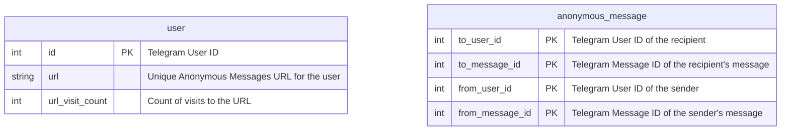

# Database

```mermaid
erDiagram
  user {
    int id PK "Telegram User ID"
    string url "Unique Anonymous Messages URL for the user"
    int url_visit_count "Count of visits to the URL"
  }

  anonymous_message {
    int to_user_id PK "Telegram User ID of the recipient"
    int to_message_id PK "Telegram Message ID of the recipient's message"
    int from_user_id PK "Telegram User ID of the sender"
    int from_message_id PK "Telegram Message ID of the sender's message"
  }
```
